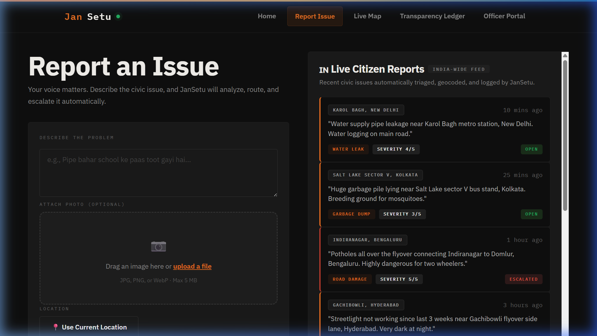

<div align="center">
  
</div>

# **JanSetu 🏙️**
> **From Voice Note to Civic Action.**  
> An autonomous multi-agent civic operating system built for the **Vibe2Ship** Hackathon (Coding Ninjas × Google for Developers).

[](https://aistudio.google.com)
[](https://firebase.google.com)
[](https://developers.google.com/maps)
[](https://ai.google.dev/competition)

---

## 🔗 **Production Deployment**
* **Live Site**: [https://jansetu-dev.web.app/](https://jansetu-dev.web.app/)

---

## 📋 **Hackathon Problem Statement**
### **Community Hero - Hyperlocal Problem Solver**

**Background**
> Communities frequently face issues such as potholes, water leakages, damaged streetlights, waste management concerns, and public infrastructure challenges. Reporting these issues is often fragmented, difficult to track, and lacks transparency.

**Challenge**
> Build a platform that enables citizens to identify, report, validate, track, and resolve community issues through collaboration, data, and intelligent automation. The solution should encourage transparency, accountability, and community participation.

---

## 💡 **The JanSetu Solution**
JanSetu is **not** a complaint box. It is an **autonomous civic operating system** that bridges the gap between citizens and municipal bodies. Instead of standard chronological queues that languish in bureaucratic folders, JanSetu uses **directed multi-agent chains** to actively escalate tickets, measure priority through economic impact, and verify resolutions.

```
                  [ CITIZEN VIEW ]
           Speak Hindi/English Voice Note
                         ↓
               ┌──────────────────┐
               │ 1. Triage Agent  │ ── Classifies, geocodes & sets SLA
               └──────────────────┘
                         ↓
               ┌──────────────────┐
               │ 2. Dedup Agent   │ ── Merges spatial-temporal duplicates
               └──────────────────┘
                         ↓
               ┌──────────────────┐
               │ 3. COI Engine    │ ── Calculates Cost of Inaction (COI)
               └──────────────────┘
                         ↓
               ┌──────────────────┐
               │4. SLA Watchdog   │ ── Searches officials, writes escalation letter
               └──────────────────┘
                         ↓
                  [ OFFICER PORTAL ]
         Priority-Ranked Queue Resolution
                         ↓
               ┌──────────────────┐
               │5. Verification   │ ── Audits before/after resolution photos
               └──────────────────┘
                         ↓
             [ PUBLIC TRANSPARENCY LEDGER ]
```

---

## 🧠 **Multi-Agent Architecture**

| Agent | Core Logic | Google Tech / API |
|---|---|---|
| **Triage Agent** | Translates raw speech, detects landmarks, extracts category, geocodes coordinates, and sets SLA deadlines. | Gemini 1.5 Pro + Geocoding API |
| **Duplicate Detector** | Groups nearby temporal issues, preventing spam and cluster-merging related reports. | Gemini 1.5 Pro + Haversine geo-bounds |
| **COI Engine** | Calculates the **Cost of Inaction (COI)** based on hazard risk, population density, and infrastructure impact. | Gemini 1.5 Pro |
| **SLA Watchdog** | Scans web info to locate correct regional nodal officer contacts and drafts formal escalation letters upon SLA breach. | Gemini 1.5 Pro + Search Grounding |
| **Verification Agent** | Audits before/after photos using multimodal vision checking to confirm issues are genuinely resolved before closing. | Gemini Vision |

---

## 🌟 **Key Features & UI Polish**
1. **Zero-UI Multilingual Reporting**: Citizens talk naturally in English, Hindi, or mixed dialects. The system transcribes, translates, and structures the ticket automatically.
2. **Modern Drag-and-Drop Dropzone**: Implements a Google Lens-style upload box supporting drags, file uploads, file size checks, and clean removable states.
3. **Live Map & Heatmaps**: Powered by Leaflet showing markers and high-risk zone polygons representing automated spatial clustering.
4. **CPGRAMS, MyGov & NGO Directory**: Officer portal contains a split-pane layout integrating directories for official public grievance channels (CPGRAMS, MyGov, MoHUA) and NGOs (Janaagraha, Praja Foundation).
5. **Transparency Ledger**: Chronological, immutable public audit logs containing every ticket step, SLA letter, and AI vision verification verdict.

---

## 📂 **Project Directory Structure**
```
jansetu/
├── vibe2ship_banner.png      # Vibe2Ship Logo header
├── SUBMISSION.md             # Standard Hackathon Doc
├── src/
│   ├── pages/
│   │   ├── CitizenView/      # Dual-column Voice reporting & live feed
│   │   ├── AdminDashboard/   # Officer Portal & Gov/NGO Directory
│   │   ├── PublicLedger/     # Open public audit ledger
│   │   └── MapView/          # Live Leaflet Map & risk polygons
│   ├── components/
│   │   ├── Navbar/           # Main navigation
│   │   └── Footer/           # Shared Vibe2Ship branded footer
│   ├── services/
│   │   ├── firebase.js       # Firebase SDK config
│   │   ├── api.js            # Cloud Function call wrappers
│   │   └── schema.js         # Firestore schema docs
│   ├── index.css             # Global fluid design system
│   └── App.jsx               # Router & shared footer layout
├── functions/
│   ├── agents/               # Gemini 1.5 Pro agent implementations
│   └── index.js              # Cloud Functions config
├── firestore.rules           # Security rules for DB
└── storage.rules             # Upload constraints for assets
```

---

## ⚙️ **Local Setup Instructions**

### **Prerequisites**
* Node.js 18+
* Firebase CLI: `npm install -g firebase-tools`

### **1. Clone and Install**
```bash
git clone https://github.com/Anubhav2506/JanSetu.git
cd jansetu
npm install
```

### **2. Setup Environment Variables**
Create a `.env` in the root:
```env
VITE_FIREBASE_API_KEY=your_key
VITE_FIREBASE_AUTH_DOMAIN=jansetu-dev.firebaseapp.com
VITE_FIREBASE_PROJECT_ID=jansetu-dev
VITE_FIREBASE_STORAGE_BUCKET=jansetu-dev.firebasestorage.app
VITE_FIREBASE_MESSAGING_SENDER_ID=633686150170
VITE_FIREBASE_APP_ID=your_id
VITE_GOOGLE_MAPS_API_KEY=your_maps_key
```

### **3. Run Development Server**
```bash
npm run dev
```
The site will run on `http://localhost:5173`.

---

## 🔒 **Security & Production Safeguards**
* **Zero Client Keys**: No Gemini API keys are hardcoded in the client bundle. All agent reasoning is proxied securely through serverless Cloud Functions.
* **Strict DB Rules**: Cloud Firestore and Storage security rules restrict read/write access to valid objects and enforce size bounds (<5MB uploads).
* **Grounding Accuracy**: Search Grounding prevents hallucination by fetching actual municipal officer contacts dynamically.

---
*Built with ❤️ for the Vibe2Ship Hackathon — Coding Ninjas × Google for Developers*
