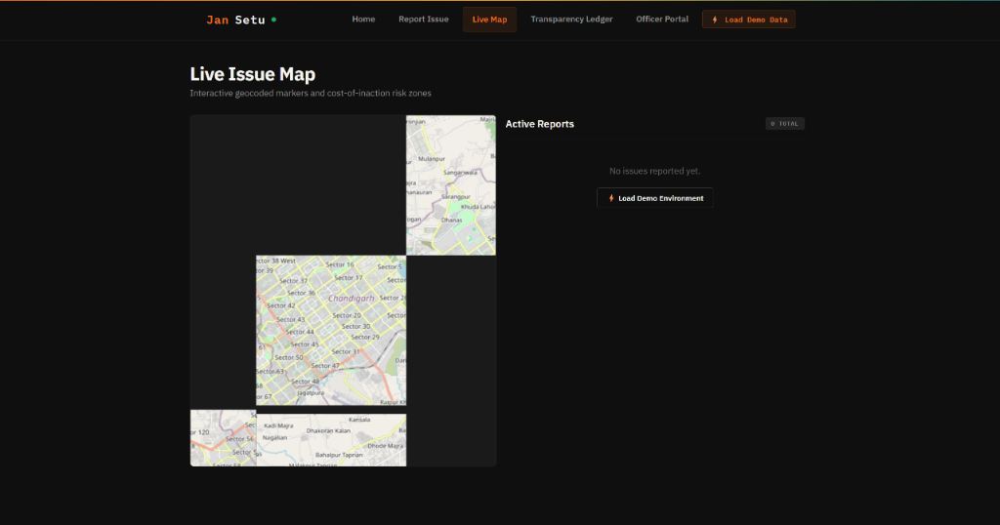

  

---

# **Community Hero - Hyperlocal Problem Solver**

### **Background**
Communities frequently face issues such as potholes, water leakages, damaged streetlights, waste management concerns, and public infrastructure challenges. Reporting these issues is often fragmented, difficult to track, and lacks transparency.

### **Challenge**
Build a platform that enables citizens to identify, report, validate, track, and resolve community issues through collaboration, data, and intelligent automation.
The solution should encourage transparency, accountability, and community participation.

#### **Example Features:**
* Image and video-based issue reporting
* AI-powered issue categorization
* Geo-location and mapping
* Community verification
* Real-time issue tracking
* Impact dashboards
* Predictive insights
* Gamification for citizen engagement

#### **Evaluation Focus:**
The solution should demonstrate how AI can help communities address local challenges more efficiently through improved reporting, verification, tracking, and resolution of issues.

---

# **Submission: JanSetu**
*Autonomous Multi-Agent Civic Operating System*

## **1. Solution Overview**
JanSetu shifts the civic grievance paradigm from standard "passive complaints lists" to an **active, self-triage, and self-escalating operating system**. Instead of forcing citizens to navigate confusing municipal portals, select exact categories, or manually search for geolocations, JanSetu exposes a **Zero-UI voice interface** where citizens speak naturally in English, Hindi, or their native dialect.

Behind the scenes, JanSetu orchestrates a **directed acyclic graph (DAG) of five specialized Gemini-powered agents** acting as autonomous municipal actors:
1. **Triage Agent**: Takes voice transcripts + photos, classifies categories, identifies landmarks, geocodes coords, and schedules SLA deadlines.
2. **Duplicate Detector**: Groups spatial-temporal overlaps to prevent ticket duplication.
3. **COI Engine (Cost of Inaction)**: Formulates dynamic economic risk prioritizing based on severity, population density, and infrastructure type.
4. **SLA Watchdog**: Automatically searches for actual nodal government engineers and drafts formal escalation letters when SLAs are breached.
5. **Verification Agent**: Uses computer vision to audit before/after photos when resolution is claimed, preventing municipal fraud.

All agent logs are committed to an immutable, publicly viewable **Transparency Ledger**, shifting the balance of power back to the community.

---

## **2. Key Features**
* 🎙️ **Zero-UI Voice Reporting**: Speak in English, Hindi, or mixed dialect; JanSetu automatically transcribes, translates, and extracts structured issue metadata.
* 📷 **Smart Drag-and-Drop Image Zone**: Modern file drop area with custom active drag states, powered by Gemini Vision for immediate image parsing.
* 💸 **COI (Cost of Inaction) Queue**: Replaces simple chronological sorting. The officer dashboard ranks tasks by dynamic severity and socioeconomic risk.
* 🗺️ **Interactive Leaflet Map & Heatmaps**: Displays active issues alongside automated high-risk zone cluster polygons showing spatial trends.
* 🏛️ **Live Government & NGO Directory**: Seamless integration with central/state redressal portals (CPGRAMS, MyGov, MoHUA Swachhata) and active municipal NGOs (Janaagraha, Praja Foundation).
* 📜 **Public Transparency Ledger**: A public, chronological audit log showing all system steps, escalation letters, and verification verdicts.

---

## **3. Technologies Used**
* **Frontend Core**: React 18, Vite (fast HMR bundling), and React Router DOM.
* **Styling & Theme**: Vanilla CSS utilizing Genesis/ElevenLabs dark-mode variables, smooth canvas backgrounds, grid patterns, glassmorphism, and responsive columns.
* **Mapping**: Leaflet.js map instance with dark tile styles.
* **Speech-to-Text**: Web Speech API for real-time multilingual transcription.

---

## **4. Google & Firebase Technologies Utilized**
* 🧠 **Gemini 1.5 Pro**: Drives NLP translation, structural classification, and priority scoring logic.
* 🔎 **Gemini Search Grounding**: Dynamically queries the live web to retrieve local municipal commissioners, engineer names, and official contact designations.
* 👁️ **Gemini Vision**: Audits and compares the original issue photo against the resolution photo.
* 🗄️ **Firebase Cloud Firestore**: Real-time database synchronizing active issues, clusters, and ledger state.
* 🔑 **Firebase Authentication**: Provides anonymous citizen session generation alongside secure email credentials for administrative officers.
* 📦 **Firebase Storage**: Hosts uploaded photos and audits resolution proofs with strict security rules.
* ⚡ **Firebase Cloud Functions**: backend proxy housing all Gemini and search grounding integrations securely.
* 🚀 **Firebase Hosting**: Deploys the static production bundle at `jansetu-dev.web.app`.
